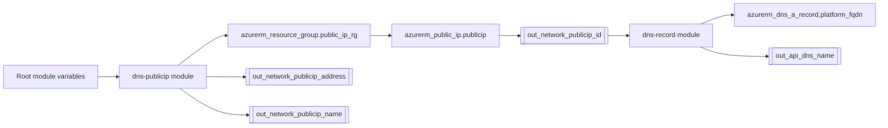

# Terraform ARM v3 Public IP DNS Record

[](https://www.terraform.io/)
[](https://registry.terraform.io/providers/hashicorp/azurerm/latest)
[](./LICENSE.md)

Terraform module composition that:

1. Creates (or ensures) an Azure Resource Group for networking assets.
2. Creates a **Standard Static** Azure **Public IP**.
3. Creates an Azure DNS **A record** that targets this Public IP via `target_resource_id`.

This repository is usually consumed as a standalone Terraform root module (it already contains `providers.tf`, `modules.tf`, `variables.tf`, etc.).

## What it creates

- `azurerm_resource_group` for the Public IP (in the `dns-publicip/` submodule)
- `azurerm_public_ip` Standard/Static (in the `dns-publicip/` submodule)
- `azurerm_dns_a_record` pointing to the Public IP by resource id (in the `dns-record/` submodule)

## Architecture

### Mermaid flowchart



## Repo layout

- `modules.tf`: wires the two submodules
- `providers.tf`: pins Terraform/provider versions and configures `azurerm`
- `variables.tf`: root module inputs
- `outputs.tf`: root module outputs
- `dns-publicip/`: submodule that creates RG + Public IP
- `dns-record/`: submodule that creates DNS A record targeting the Public IP
- `_run-*.sh`: helper scripts simplifying init/plan/apply
- `_export_core.sh`: exports Terraform outputs as `TF_VAR_*` environment variables (useful to chain modules)

## Prerequisites

- Terraform **>= 1.3.9**
- Azure CLI (`az`) available in your shell
- Credentials configured as Terraform variables:
  - `subscription_id`, `tenant_id`, `client_id`, `client_secret`

> Notes
> - This repo configures an `azurerm` backend in `providers.tf` (`backend "azurerm" {}`) and `_run-init.sh` expects a backend storage account named `cosmotechstates`.
> - If you use a different backend, adjust `_run-init.sh` accordingly.

## Usage

### 1) Configure variables

This repo supports using a `terraform.tfvars` and/or `terraform.auto.tfvars`.

- Example baseline is available in `terraform.tfvars`.
- Per-user/per-environment secrets often go in `terraform.auto.tfvars`.

### 2) Init / plan / apply (helper scripts)

The script `_run-terraform.sh` runs init+plan+apply:

```bash
./_run-terraform.sh
```

Under the hood it executes:

- `./_run-init.sh <state_key>`
- `./_run-plan.sh terraform.tfvars`
- `./_run-apply.sh`

If you want to run Terraform directly (without scripts), you can do so as well.

### 3) Export outputs as TF_VAR_* (optional)

`_export_core.sh` is designed to chain outputs from one Terraform working directory into another by exporting them as environment variables.

It runs:

- `terraform -chdir=<dir> output > out_core_ip_dns.txt`
- rewrites it into `export TF_VAR_*="..."` lines

Example output file: `out_core_ip_dns.txt`

## Inputs

Root module input variables are declared in `variables.tf`.

### Azure / provider

| Name | Type | Required | Description |
|---|---:|:---:|---|
| `subscription_id` | `string` | Yes | Azure subscription id. |
| `tenant_id` | `string` | Yes | Azure tenant id. |
| `client_id` | `string` | Yes | Service principal client/application id. |
| `client_secret` | `string` | Yes | Service principal secret. |
| `location` | `string` | Yes | Azure region (e.g. `westeurope`). |

### Project tagging

These are used to build Public IP name and tags in `dns-publicip/`.

| Name | Type | Required | Description |
|---|---:|:---:|---|
| `project_customer_name` | `string` | Yes | Customer slug/name. |
| `project_name` | `string` | Yes | Project slug/name. |
| `project_stage` | `string` | Yes | Environment/stage (e.g. `Dev`). |
| `project_cost_center` | `string` | Yes | Cost center tag value. |

### Networking

| Name | Type | Required | Description |
|---|---:|:---:|---|
| `publicip_resource_group` | `string` | Yes | Name of the Resource Group that will contain the Public IP. Created if missing. |
| `network_dns_zone_rg` | `string` | Yes | Resource Group containing the DNS Zone. |
| `network_dns_zone_name` | `string` | Yes | DNS zone name (e.g. `api.cosmotech.com`). |
| `network_dns_record` | `string` | Yes | DNS record name (e.g. `devops`). |

## Outputs

Root module outputs are declared in `outputs.tf`.

| Name | Description |
|---|---|
| `out_network_publicip_address` | Allocated Public IP address. |
| `out_network_publicip_name` | Public IP resource name. |
| `out_network_publicip_resource_group` | RG name used for the Public IP. |
| `out_network_publicip_id` | Public IP Azure resource id. |
| `out_network_dns_record` | The record label (left part). |
| `out_network_dns_zone_name` | The DNS zone name. |
| `out_api_dns_name` | Fully-qualified domain name: `${network_dns_record}.${network_dns_zone_name}`. |

## Troubleshooting

### DNS A record creation fails

Common causes:

- Wrong `network_dns_zone_rg` or `network_dns_zone_name`.
- Missing permissions for the service principal on the DNS Zone resource group.
- Public IP isn’t created yet (should be handled by `depends_on` in `modules.tf`).

### Terraform backend init fails

`_run-init.sh` expects a storage account named `cosmotechstates` in RG `cosmotechstates`.

If your environment is different:

- Update `_run-init.sh` values (`RESOURCE_GROUP`, `STORAGE_ACCOUNT`, etc.)
- Or run `terraform init` with your own `-backend-config` settings.

## Security

- Don’t commit secrets to `terraform.auto.tfvars`.
- Prefer environment variables or a secret manager for `client_secret`.

## License

See `LICENSE.md`

Made with :heart: by Cosmo Tech DevOps team